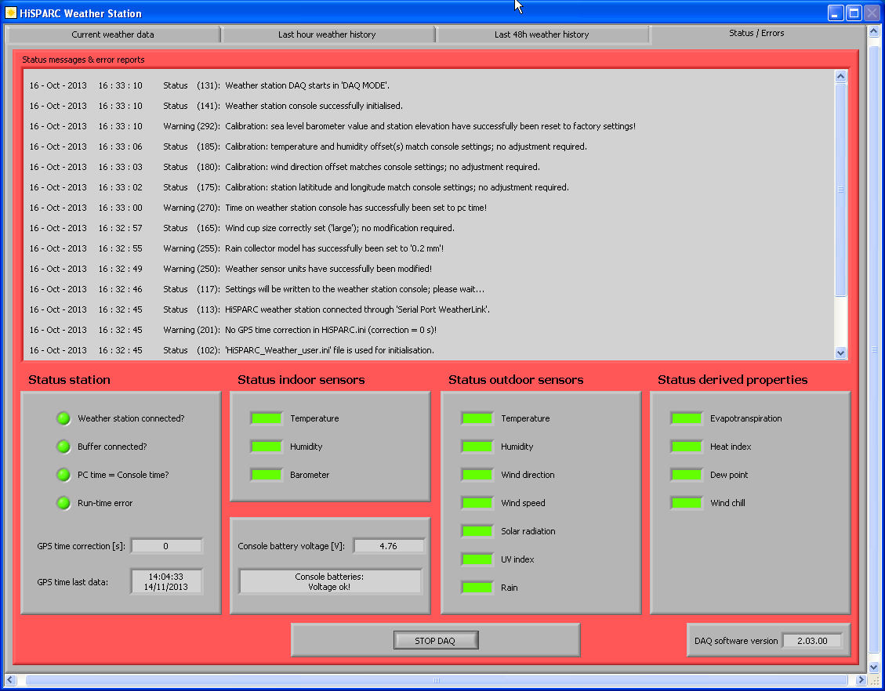

.. include:: subst.inc

Error codes
===========

The |hisparc| weather station data acquisition program generates
status/error messages in 'Status messages & error reports' tab to inform
you about the progress of the start/end process and when errors occur.
Here is a screenshot of this screen, below is explained what you can see
here.

   The Status/Error tab (click to enlarge)

Status
------

The 'Status station' block (left lower corner) provides some (crucial)
general information:

- :code:`Weather station connected?` tells whether the connection
  between pc and weather station console is properly working
- :code:`Buffer connected?` is required for data transmission in DAQ mode
- :code:`PC time = Console time?` indicates whether the pc and
  console-display are synchronised
- :code:`Run-time error` refers to a fatal error that occurred (see error
  messages)
- :code:`GPS time correction` refers to the offset between pc clock and
  the GPS time as obtained by your cosmic ray set-up
- :code:`GPS time last data` indicates the last time data is read from
  the weather station console

Status indoor and outdoor sensors show which of the sensors (you have to
make a selection on the 'Settings' tab!) is read out correctly (green),
fails (red) or is not part of you set of sensors (grey - depends on your
hardware/selection)

The voltage on the batteries in the weather station console is sampled.
For most console models this provides accurate information on whether
the back-up batteries need to be replaced. Some models give a random
voltage when no batteries are inserted. Make sure that your console
indeed has healthy batteries!

Messages
--------

The 'Status messages & error reports' window logs relevant information
after (re-)start of the weather station. The messages inform you about
occurrences in the system. In addition to the following messages (which
are usually the result of user interference)::

    Start HiSPARC weather station DAQ.
    Stop HiSPARC weather station DAQ.
    Restart weather station from user initialisation file.
    Re-initialise weather station from default initialisation file

Status (1xx)
^^^^^^^^^^^^

Status messages may be issued which inform about the initialisation
process of the weather station or document when the user pressed a
button. They also confirm whether an action was successfully executed.
When 'DAQ MODE' is selected, the status messages are logged and
automatically stored into the central database at Nikhef for error
tracking purposes. Status messages range from 101 - 199:

101. Copied 'HiSPARC_Weather_default.ini' to 'HiSPARC_Weather_user.ini'
102. 'HiSPARC_Weather_user.ini' file is used for initialisation.
103. User ignores 'STOP PROGRAM', continue...
104. Weather station parameters wil be initialised; please wait...

111. HiSPARC weather station connected through 'USB WeatherLink'.
112. HiSPARC weather station 'USB WeatherLink' is closed.
113. HiSPARC weather station connected through 'Serial Port WeatherLink'.
114. HiSPARC weather station 'Serial port WeatherLink' is closed.

117. Settings will be written to the weather station console; please
     wait...

121. User pressed 'HELP' button in serial connection/USB dialogue.
122. User modified station connection settings in serial/USB dialogue;
     changes have been saved.
123. Switched to 'DAQ MODE'.
124. User pressed 'STOP PROGRAM' button.
125. (New) settings have been saved.
126. User pressed 'CALIBRATE' button; please wait until settings have
     been uploaded...
127. User skips weather station calibration, continue...
128. User pressed 'RESET' button but skips reset.
129. User pressed 'HELP' button.
130. Switched to 'STOP DAQ' mode.
131. Weather station DAQ starts in 'DAQ MODE'.

136. Calibration: latitude and/or longitude have not been modified.
137. Calibration: temperature and/or humidity offset(s) have not been
     modified.
138. Calibration: sea level barometer and/or station elevation have not
     been modified.
139. Calibration: wind direction offset has not been modified.

141. Weather station console successfully initialised.

150. Weather sensor units are correctly set; no modifications required.

155. Rain collector model correctly set ('0.2 mm'); no modification required.

165. Wind cup size correctly set ('large'); no modification required.

170. Time on weather station console correctly set (= pc time); no
     modification required.

175. Calibration: station latitude and longitude match console settings;
     no adjustment required.

180. Calibration: wind direction offset matches console settings; no
     adjustment required.

185. Calibration: temperature and humidity offset(s) match console
     settings; no adjustment required.

Warnings (2xx)
^^^^^^^^^^^^^^

Warning messages inform about successfully actions and/or non-fatal
errors. There are various reasons why a warning is issued. When 'DAQ
MODE' is selected, the status messages are logged and automatically
stored into the central database at Nikhef for problem analyses. Warning
messages range from 201 - 299. Their meaning is explained below:

201. No GPS time correction in HiSPARC.ini (correction = 0 s)!
202. PC clock time error in HiSPARC.ini (GPS time correction is set to 0
     s)!
203. Error in GPS time stamp in HiSPARC.ini (GPS time correction is set
     to 0 s)!
204. Unknown message in HiSPARC.ini (GPS time correction is set to 0 s)!

**Reason**: the weather station is used in 'stand-alone mode', that is,
there is no GPS time information generated by the |hisparc| cosmic ray
station. The |hisparc| DAQ program calculates the time difference
between GPS and local pc-clock (both programs need to be running on the
same pc!) in order to synchronise cosmic ray time-stamps and weather
station measurements. Switching on the |hisparc| DAQ system
automatically enforces correct synchronisation (every 10 minutes the
offset is adjusted).

205. Time difference too large in HiSPARC.ini (GPS time correction is
     set to 0 s)!

**Reason**: GPS is (not yet) producing the correct time (self-survey not
completed or not yet done). Check the GPS of your cosmic ray set-up!

211. Cannot open HiSPARC weather station connection through 'USB
     WeatherLink'!
212. Cannot close HiSPARC weather station connection through 'USB
     WeatherLink'!

**Reason**: USB connection between pc and weather station console was
found, but failed!

213. Cannot open HiSPARC weather station connection through 'Serial Port
     WeatherLink'!
214. Cannot close HiSPARC weather station connection through 'Serial
     Port WeatherLink'!

**Reason**: Serial connection (or serial to USB converter) between pc
and weather station console failed!

215. Station ID = 0; please select a valid station number!

**Reason**: You have to provide a valid station number. In general this
is the same number as your cosmic ray station

216. Serial COM port number = 0; please select a valid port number!

**Reason**: You make use of a serial connection or serial to USB
converter that generates a COM port on your pc. You have to select
number associated with the correct COM port. You may obtain this number
by analysing your hardware ('Apparatenbeheer') under Windows.

217. Try automatic reconnection to HiSPARC weather station console!

**Reason**: Connection between pc and weather station console failed;
the program tries repair the connection

221. Please check your internet connection; cannot reach HiSPARC
     document server!

**Reason**: You pressed the 'HELP' button and cannot obtain the
help-file since either the internet connection is down or the document
server is (temporarily) not available

222. User pressed 'STOP PROGRAM' button in serial/USB dialogue!
223. Overflow event queue for buffer database; 1 event is lost!

**Reason**: In rare cases this may occur during the 'manual' calibration
procedure while the program continues to receive data from the weather
station console and may run out of memory. Throwing away events prevents
the system from crashing (in any case you are not running in 'DAQ MODE').

224. Overflow event queue for front panel graphs!

**Reason**: Should never occur, used for debugging purposes

226. No modification(s); proposed calibration parameters equal
calibration parameters on console!

228. User pressed 'RESET' button; restart with default settings!

Following set of warning messages may hint at either a bad connection
between pc and and weather station console or a problem with the console
(firmware/hardware) itself:

231. Failed to set timeout/read weather station and/or DLL/Firmware
     version/date, will retry!
232. Failed to initialise weather sensor units, will retry!
233. Failed to set rain collector model to '0.2 mm', will retry!
234. Failed to set wind cup size to 'large', will retry!
235. Failed to synchronise pc clock and weather station clock, will
     retry!
236. Calibration: failed to set latitude and/or longitude, will retry!
237. Calibration: failed to set temperature and/or humidity offset(s),
     will retry!
238. Calibration: failed to set sea level barometer and/or station
     elevation, will retry!
239. Calibration: failed to set wind direction offset, will retry!

241. Failed to initialise weather station console, will retry!

250. Weather sensor units have successfully been modified!

255. Rain collector model has successfully been set to '0.2 mm'!

265. Wind cup size has successfully been set to 'large'!

270. Time on weather station console has successfully been set to pc
     time!

275. Calibration: station latitude and/or longitude have successfully
     been modified!

280. Calibration: wind direction offset has successfully been modified!

285. Calibration: temperature and/or humidity offset(s) have
     successfully been modified!

292. Calibration: sea level barometer value and station elevation have
     successfully been reset to factory settings!

295. Calibration: sea level barometer value has successfully been
     modified!

298. Calibration: station elevation has successfully been modified!

Errors (3xx)
^^^^^^^^^^^^

Vast majority of error messages are fatal and will force the weather
station data acquisition to stop. When 'DAQ MODE' is selected -
depending on which part of the initialisation phase has successfully
completed -, the error messages are logged and automatically stored into
the central database at Nikhef for error tracking purposes. For error
messages related to hardware and firmware versions, please consult the
Davis website and check carefully(!) whether you may update/restore the
firmware trough the serial/USB link (see:
http://www.davisnet.com/support/weather/downloads/software_frmwr.asp).
Error messages range from 301 - 399. Their meaning is explained below:

301. Path to HiSPARC weather station DAQ software has not been found!

**Reason**: Software is not properly installed; executable is missing or
mis-placed

302. Initialisation file 'HiSPARC.ini' has not been found!

**Reason**: see 301; (general) initialisation file is missing or
mis-placed

303. Initialisation file 'HiSPARC_Weather_default.ini' has not been
     found!

**Reason**: see 301; initialisation file with default settings is
missing or mis-placed

304. Failed copying 'HiSPARC_Weather_default.ini' to
     'HiSPARC_Weather_user.ini'!

**Reason**: may hint at authorisation problems for the account since the
file can not be written

306. Error in reading parameters from HiSPARC.ini!

**Reason**: (general) initialisation file may be outdated (old version)
or corrupted

322. Lost connection to weather station; will automatically try to
     reconnect!

**Reason**: Connection between pc and weather station console failed;
the program tries repair the connection

323. Cannot connect to buffer database!

**Reason**: Most likely, the MySQL program is not running; after
verifying that all software is correctly installed, restart your computer

330. Failed to initialise weather station supporting software library
     (DLL), quit!

**Reason**: Should never occur, used for debugging purposes or hints at
software installation problem

340. This weather station model is not supported!

**Reason**: Only Davis Vantage weather stations are supported for now...

Following errors may occur when the connection between pc and weather
station console failed or is timed-out, firmware (in the console) is
incompatible with the action the program tries to execute or the console
has a hardware problem. Try to reset the console (remove power -
including batteries! - ) and restart the pc

341. Failed to initialise weather station console several times, quit!

350. Failed to read weather sensor units!
351. Failed to write weather sensor units!
352. Failed to read weather sensor units after modification!
353. Failed to match weather sensor units after write/read operation!

355. Failed to read rain collector model!
356. Failed to write rain collector model!
357. Failed to read rain collector model after modification!
358. Failed to match rain collector model after write/read operation!
359. Failed to set rain collector model ('0.2 mm') on console!
360. Failed to read rain collector model from console after modification!
361. Failed to match rain collector model from console after modification!
362. Failed to read rain collector model from console!

365. Failed to read wind cup size!
366. Failed to write wind cup size!
367. Failed to read wind cup size after modification!
368. Failed to set wind cup size to 'large'; please check/modify cup
     size on the weather station console!

370. Failed to read time from weather station console!
371. Failed to write pc time to weather station console!
372. Failed to read time from weather station console after modification!
373. Failed to match time from weather station console after write/read
     operation!

Following errors may occur while trying to load (calibration) parameters
into the weather station console. The success of some of the
(calibration) actions may depend on (a general statement can not be made
here):

- console hardware version
- console firmware version (firmware should be March 2004 Rev. B or
  later)
- errors in software interface from Davis (bugs in LabView code
  interface nodes)

375. Calibration: failed to read station latitude and/or longitude!
376. Calibration: failed to write station latitude!
377. Calibration: failed to write station longitude!
378. Calibration: failed to read station latitude and/or longitude after modification!
379. Calibration: failed to match station latitude and/or longitude after write/read operation!
380. Calibration: failed to read wind direction offset!
381. Calibration: failed to write wind direction offset!
382. Calibration: failed to read wind direction offset after modification!
383. Calibration: failed to match wind direction offset after write/read operation!

385. Calibration: temperature and/or humidity offset(s) out of range!
386. Calibration: failed to load temperature and/or humidity calibration data from console!
387. Calibration: failed to write temperature and/or humidity offset(s) after modification!
388. Calibration: failed to store temperature and/or humidity offset(s) into console!
389. Calibration: failed to match temperature and/or humidity offset(s) after write/read operation!
390. Calibration: failed to write sea level barometer value and/or station elevation!
391. Calibration: failed to read sea level barometer value and/or station elevation!
392. Failed to set sea level barometer and station elevation; please check/modify them on the weather station console!
393. Calibration: failed to write sea level barometer value!
394. Calibration: failed to read sea level barometer value after modification!
395. Calibration: failed to match sea level barometer value after write/read operation!
396. Calibration: failed to write station elevation!
397. Calibration: failed to read station elevation after modification!
398. Calibration: failed to match station elevation after write/read operation!
